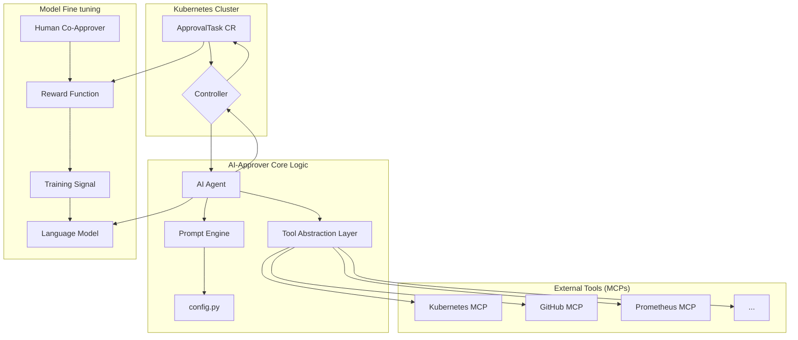

# AI-Approver for Tekton

An intelligent, event-driven Kubernetes operator that uses an AI agent to automate the approval of Tekton `ApprovalTask` custom resources. It acts as a smart, automated gate in your CI/CD pipelines, capable of making decisions based on real-time data from your cluster and other integrated systems.

## Overview

In many CI/CD pipelines, there are stages that require manual sign-off before proceeding. The `ApprovalTask` CRD for Tekton provides a mechanism to pause a pipeline and wait for this manual intervention. This project provides an intelligent agent that automates this approval process by using a Large Language Model (LLM) to analyze the task and its context.

The agent can be configured to act in one of two modes:

1.  **Co-Approver:** The AI acts as one of several required approvers. It performs automated checks and provides a preliminary approval, with a final human sign-off still required.
2.  **Full Approver:** The AI is given sole authority to approve or reject a task. This is suitable for high-confidence, low-risk scenarios where full automation is desired.

## Architecture

The system is designed as an intelligent, event-driven Kubernetes operator that automates the approval process for CI/CD tasks.



### How It Works

1.  **Event Trigger**: The workflow begins when a Tekton `ApprovalTask` Custom Resource (CR) is created or updated. This event is detected by the **Controller**.
2.  **Controller (`src/main.py`)**: The Controller, powered by the `kopf` framework, receives the `ApprovalTask` event and initiates the analysis by invoking the **AI Agent**.
3.  **AI Agent (`src/agents.py`)**: The core decision-making component. It uses a **Prompt Engine** to construct a detailed, context-rich prompt for the Language Model (LLM), dynamically built from templates and rules in `src/config.py`.
4.  **Tool Abstraction Layer**: The agent connects to a **Tool Abstraction Layer** that interfaces with multiple **Machine Control Programs (MCPs)**. This allows it to gather real-time data from various sources:
    *   **GitHub MCP**: Provides tools to inspect source code, check pull requests, analyze commit history, and detect security vulnerabilities.
    *   **Kubernetes MCP (Legacy)**: Previously used for querying live data from the Kubernetes API (e.g., check pod status, resource usage).
    *   **Prometheus MCP (Future)**: Will provide tools to query metrics, check for active alerts, and assess system load.
5.  **Analysis and Decision**: The agent uses the selected tools to gather live data, analyzes it, and generates an `approve` or `reject` decision.
6.  **Patching the Resource**: The Controller receives the decision and patches the original `ApprovalTask` CR, updating it with the AI's input.

### Model Finetuning & Improvement Loop

To ensure the AI-Approver's decisions improve over time, a training loop is a core part of the architecture:

*   **Reward Function**: After the AI agent makes a decision, it is compared to the decision of a **Human Co-Approver**.
*   **Training Signal**: Agreement between the AI and the human generates a positive reward, while disagreement generates a corrective signal.
*   **Model Fine-Tuning**: This signal is used to continuously fine-tune the underlying Language Model, reinforcing correct reasoning and ensuring the AI-Approver becomes more accurate and trustworthy over time.

## Getting Started

### Prerequisites

*   Python 3.10+
*   A running Kubernetes cluster.
*   Tekton Pipelines installed on the cluster.
*   The `ApprovalTask` CRD from the [openshift-pipelines/manual-approval-gate](https://github.com/openshift-pipelines/manual-approval-gate) project installed on the cluster.

### Prerequisites

-   A running Kubernetes cluster.
-   Tekton Pipelines installed on the cluster.
-   The `ApprovalTask` CRD from the [openshift-pipelines/manual-approval-gate](https://github.com/openshift-pipelines/manual-approval-gate) project must be installed on the cluster.
-   A container registry (like Docker Hub, GCR, or Quay.io) to store the agent's image.

### Configuration

1.  Edit `python-agent/config.yaml` to define the agent's behavior. You will need to specify:
    -   The Kubernetes namespace(s) the agent should monitor.
    -   The name of the user or ServiceAccount the agent will use for approvals.
    -   The logic or rules for making approval/rejection decisions.

### Building and Deploying the Agent

  **Deploy the agent to your Kubernetes cluster:**
    You will need to create a Kubernetes Deployment (and likely a ServiceAccount, Role, and RoleBinding) to run the agent. The Deployment should use the image you just built and pushed. Ensure the ServiceAccount has the necessary permissions to `get`, `list`, `watch`, and `patch` `approvaltasks` resources.

    Example deployment manifests can be found in the `config/` directory. You will need to customize them for your environment.

    ```sh
    ko apply -f config/
    ```

Once deployed, the agent will start monitoring for `ApprovalTask` resources and acting on them according to its configuration.


#### Running locally
Assuming you have GEMINI_API_KEY setup in environment.
```
uv venv
source .venv/bin/activate
uv pip install -r requirements.txt
export MODEL_NAME=gemini-2.5-pro-preview-05-06
kopf run src/main.py
```


## Configuration

The agent's behavior is primarily configured in `src/config.py`. The `PROMPT_CONFIG` dictionary allows you to customize the prompts sent to the LLM, including:

*   **`base_prompt`**: The main template for the analysis request.
*   **`considerations`**: A list of points the agent should always consider.
*   **`rules`**: A list of conditional instructions. For example, you can add a rule to automatically reject any pipeline that uses a `:latest` image tag.
*   **`output_format_instruction`**: Defines how the LLM should structure its response to make it easily parsable.

By modifying this configuration, you can tailor the agent's decision-making process to your organization's specific needs and policies.

### Setup GitHub MCP

1. **Create GitHub Personal Access Token**:
   - Go to [GitHub Settings > Personal Access Tokens](https://github.com/settings/tokens)
   - Create a token with `repo`, `read:org`, and `read:user` scopes

2. **Set Environment Variables**:
   ```bash
   export GITHUB_PERSONAL_ACCESS_TOKEN=your_token_here
   ```

### PipelineRun Configuration

Your Pipeline should include a `git-clone` task with the repository information:

```yaml
apiVersion: tekton.dev/v1
kind: Pipeline
metadata:
  name: my-pipeline
spec:
  tasks:
  - name: fetch-from-git
    taskRef:
      name: git-clone
    params:
    - name: url
      value: https://github.com/owner/repo.git
    - name: revision
      value: main
```
